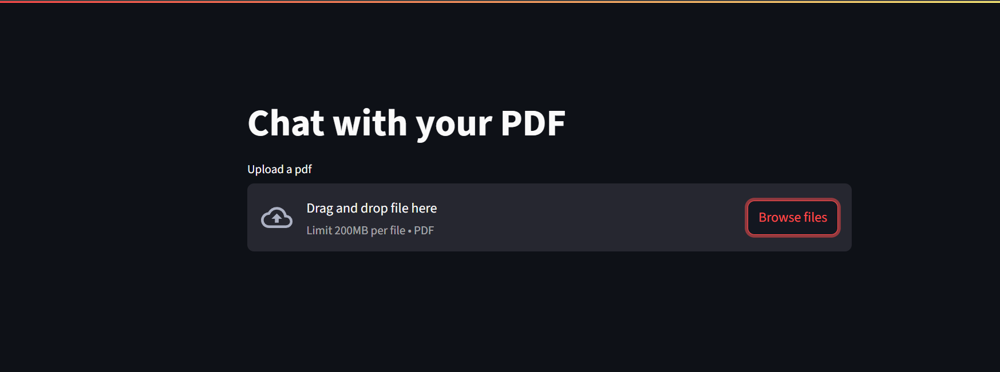
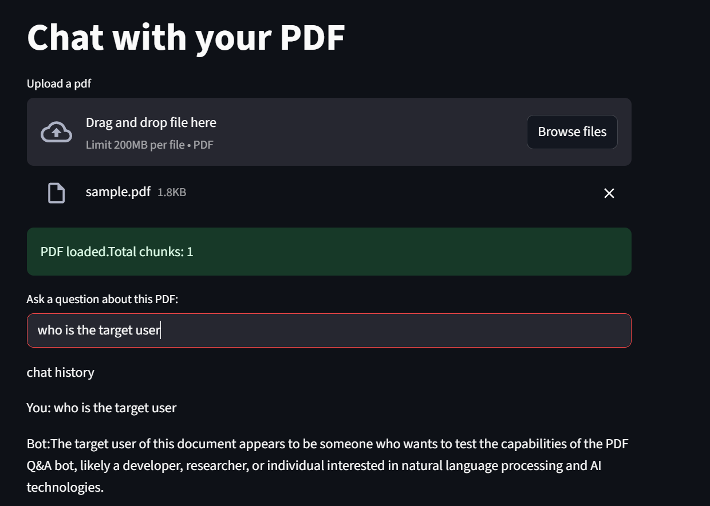

# 🧠 PDF Q&A Chatbot

A fully functional chatbot that lets you upload any PDF and ask natural language questions about its content.  
Built with **LangChain**, **FAISS**, **Hugging Face embeddings**, and **Groq's blazing-fast LLaMA models**, all inside a simple **Streamlit UI**.

---

## 🚀 Features

- 📄 Upload any PDF (e.g. resume, policy, research paper)
- 🔍 Automatically extracts and chunks content
- 🤖 Finds relevant context using FAISS + Hugging Face Embeddings
- 💬 Answers questions using Groq's LLaMA-3 model
- 🌐 Clean ChatGPT-like Streamlit interface with multi-turn memory
- 💸 100% Free APIs (no OpenAI quota needed)

---

## 🧰 Tech Stack

| Component | Technology |
|----------|-------------|
| UI       | Streamlit |
| PDF Parsing | PyPDF2 |
| Chunking & Embedding | LangChain + sentence-transformers |
| Vector Store | FAISS |
| LLM (Q&A) | Groq API (OpenAI-compatible) |
| API Keys | `.env` file via `python-dotenv` |

---

## 🔐 Setup

1. **Clone the repo** (if you haven't already):

```bash
git clone https://github.com/your-username/pdf-qa-chatbot.git
cd pdf-qa-chatbot
```

## 📦 Requirements

Install dependencies (recommended in a virtual environment):

```bash
python -m venv venv
venv\Scripts\activate
pip install -r requirements.txt
```
Get your Groq API key
sign up  at https://console.groq.com and copy your key.

create .env file in your root directory and paste your API key:
```
GROQ_API_KEY=your-groq-api-key-here
```
To run the app locally

```
streamlit run web_app.py
```
## 📸 Screenshots

### 🖼️ Before Upload


### 🤖 Chat in Action

